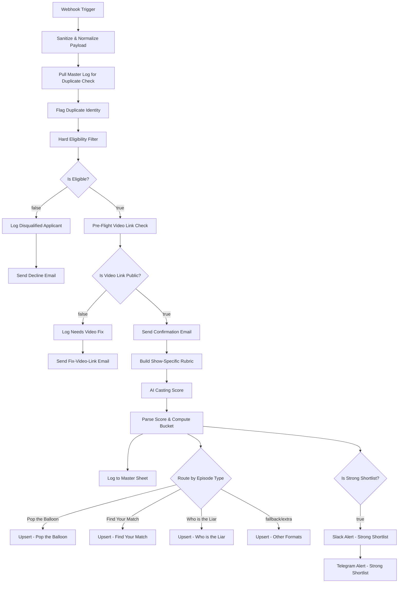
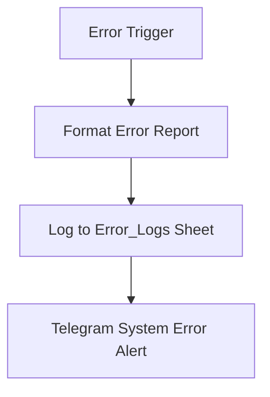

# Workflow Architecture

## Main pipeline

## Error handler (separate workflow)

The error handler is a **separate workflow**, not another branch on the main one — n8n's Error Trigger only fires when it's set as the designated error workflow in the main pipeline's Settings, and it catches failures no matter where in the main pipeline they happen, including inside a Code node before any of the main pipeline's own IF logic could react to it.

---

## Key design decisions

- **Per-show AI rubric, not one generic prompt.** "Build Show-Specific Rubric" swaps the scoring criteria based on `episodeType` before the AI ever sees the questionnaire — Pop the Balloon weighs charisma and quick wit, Find Your Match weighs emotional intelligence and vulnerability, Who is the Liar weighs composure and bluffing. Scoring everyone against the same rubric regardless of show tells a producer nothing useful.
- **Hard eligibility gate before AI scoring.** Age, video link, availability, and location are checked with plain code logic first — nobody burns an OpenAI call or gets a "fix your video" email if they were never eligible to begin with.
- **One write per applicant, not two.** Basic info and AI score are gathered into a single item before any Sheets write happens, then written once via `appendOrUpdate`. Splitting this into an initial insert plus a later `update`-by-arbitrary-column is a known bad pattern (see bug log below).
- **Red flags cap the bucket at "Maybe."** A high composite score can't override a red flag the AI noticed — that always forces a human look before anyone gets an instant Slack/Telegram alert.
- **Duplicate check is a lookup, not just a hash.** A fingerprint that's computed but never compared against anything isn't deduplication. This pipeline actually reads `Master_Log` and compares phone/Instagram/TikTok against every existing row before letting an applicant through — soft-flagged, not auto-rejected, since shared devices/handles happen.
- **Instant alerts only for the top tier.** Everything below `Strong Shortlist` just sits in its show's sheet. Alerting on every applicant above a low bar creates alert fatigue and trains producers to ignore the channel.
- **The automation ranks; a human decides.** Every sheet has a `Status` column producers fill in themselves. Nothing in this pipeline auto-selects or auto-rejects a candidate for the show itself — only for the hard eligibility gate (age, valid link, location, availability), which are genuinely non-negotiable.

---

## Bug log

Documenting these here rather than burying them, since a couple of them are the kind of mistake worth knowing to check for on future builds.

1. **Webhook hung on every submission.** Original config used `responseMode: "responseNode"` with no matching Respond-to-Webhook node in the flow — n8n would never actually respond, so every submission just hung. Fixed by switching to `responseMode: "onReceived"`, which acknowledges immediately and lets the rest of the pipeline run async.

2. **Switch node silently dropped its 4th output.** `fallbackOutput` was set at the wrong nesting level (top of `rules` instead of inside `options`, and as a string name instead of `"extra"`). n8n only built 3 outputs instead of 4, so anything that should have fallen through to "Other Formats" just vanished with no error. Fixed by moving it to `options.fallbackOutput: "extra"`.

3. **`"upsert"` isn't a real n8n operation.** The correct operation string is `appendOrUpdate` — shown in the n8n UI as **"Append or Update Row."** Using an invalid operation value meant the node didn't show the operation as selected at all when reviewed in the editor.

4. **"Column to Match On" doesn't survive JSON import.** Even with the matching column set correctly in the JSON, n8n's resourceMapper field needs to read live column headers from an actually-connected sheet to populate its dropdown — which can't happen until the Document and Sheet fields are manually (re)selected in the UI after import, with a real credential attached. Every `Append or Update Row` node needs this manual reselection once per import.

5. **Avoided entirely: `update` matched on an arbitrary column instead of `row_number`.** n8n's plain `update` operation needs `row_number` as the match column, not an arbitrary field like Email — a mistake worth knowing about even though this build sidesteps it completely by using `appendOrUpdate` (which does support arbitrary matching columns) everywhere instead of a separate insert-then-update pattern.

6. **Inconsistent matching column across sheets.** `Disqualified` and `Needs_Video_Fix` initially matched on `Email` while every other tab used `Application Key` (email + show, so one person can apply to multiple shows without collisions). Fixed for consistency.

7. **Self-reported checkboxes for age and location.** Originally `ageConfirmed`/`locationConfirmed` booleans — trivially easy to just check regardless of truth. Replaced with an actual `dateOfBirth` field (age computed server-side) and a real location whitelist the submitted value has to match.

8. **Red flags didn't block the instant-alert tier.** Originally a high composite score alone determined `Strong Shortlist`, meaning a flagged applicant with strong numeric scores could still auto-ping producers as a top pick with zero human friction first. Fixed by capping the bucket at `Maybe` whenever the AI notes any red flag.
